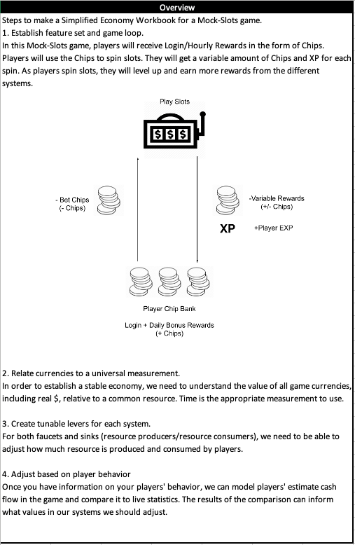
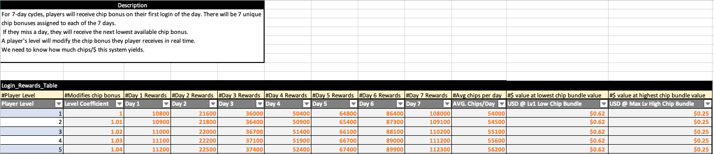
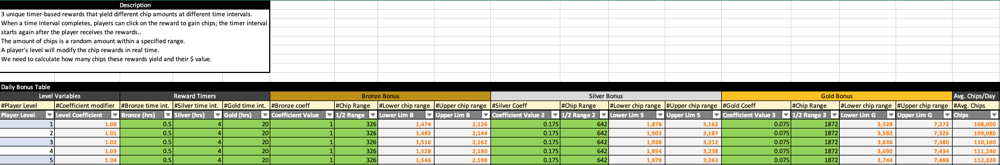
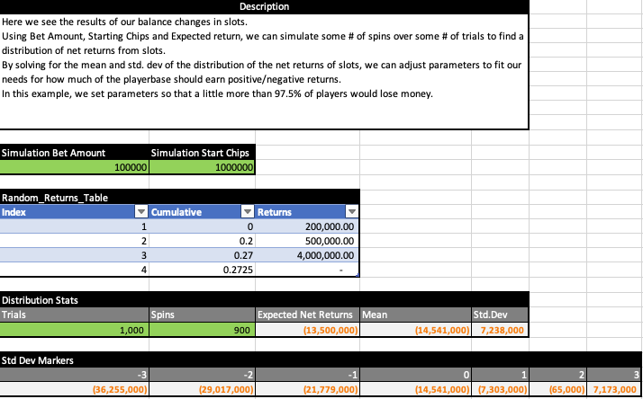
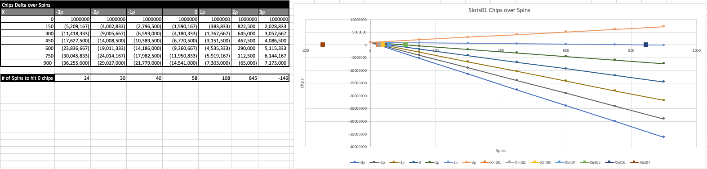
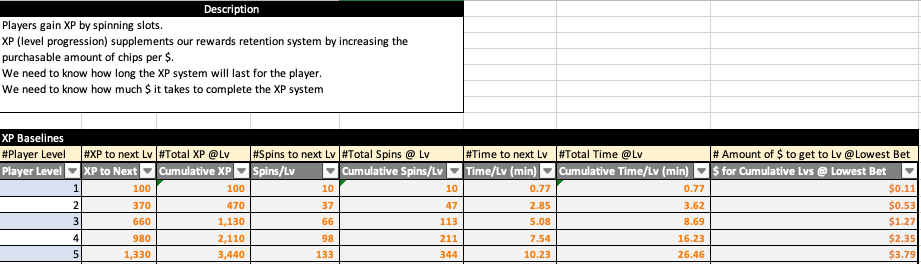
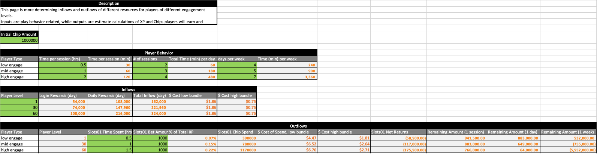
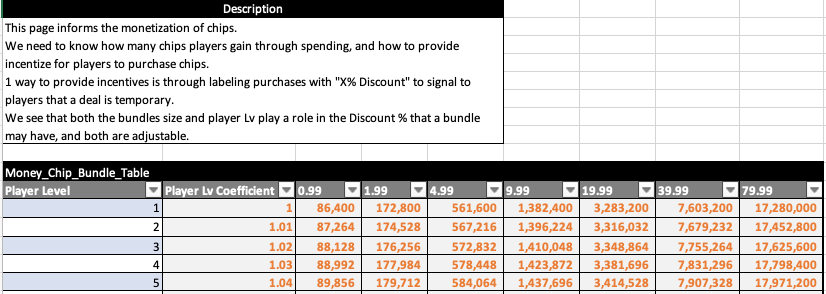

# Economy Sample
<h1>Overview</h1>
Spreadsheet that gives an overview for how to setup a sample economy for a mock-casino game. 

<h1>Login Rewards Snapshot</h1>
Spreadsheet for login rewards.

<h1>Daily Rewards Snapshot</h1>
Spreadsheet for daily rewards.

<h1>Slots Setup Snapshot</h1>
Spreadsheets for a simplified slots system.

<h1>Slots Simulation Snapshot</h1>
Spreadsheet for results of slots simulations.

<h1>XP</h1>
Spreadsheet for player XP curve.

<h1>Player Metrics</h1>
Spreadsheet addressing how to incorporate player behavior into your game economy.

<h1>Monetization</h1>
Spreadsheet for pricing resource bundles.

